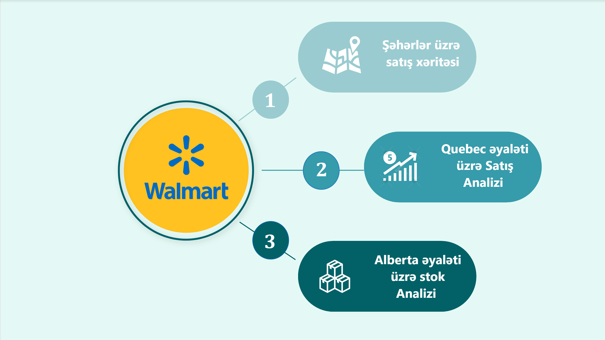
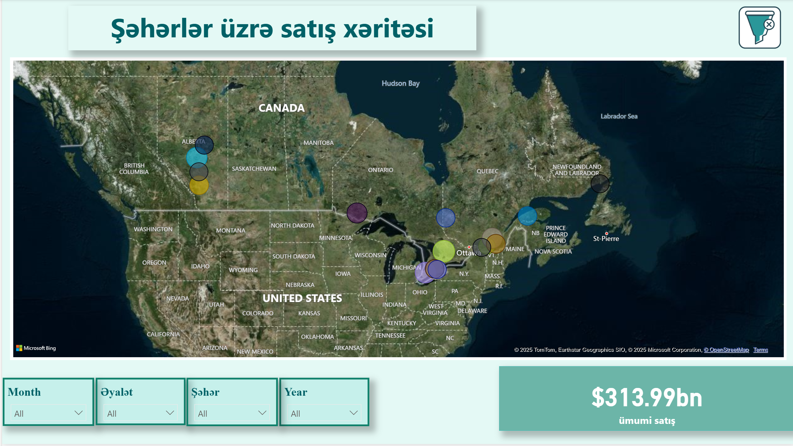
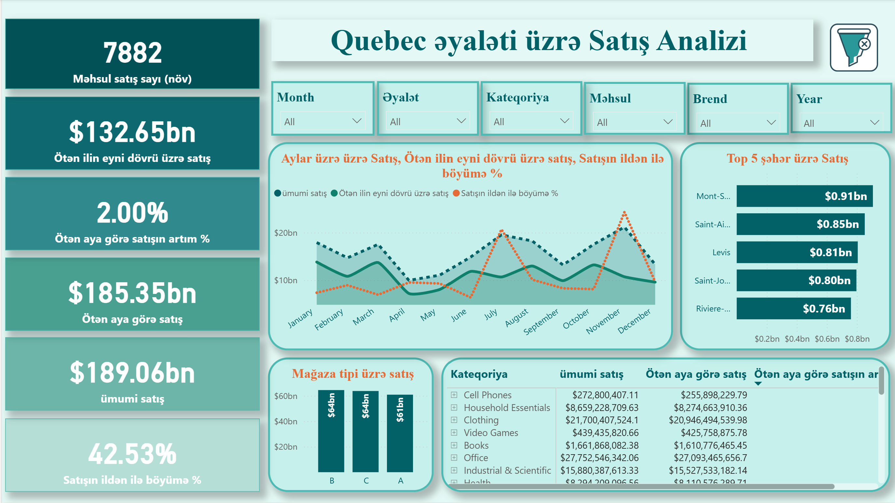

## 🛒 Walmart Sales Analysis

This project presents a Power BI dashboard created to analyze Walmart sales data.

### 🔧 Tools
- Power BI
- Excel

### 📊 Dashboard Insights
- Total sales overview
- Sales trends over time
- Performance by store and category

### 📁 Project Files
- Power BI dashboard: walmart_sales_dashboard.pbix
- Dataset: walmart_sales.xlsx Dataset

### 🖼️ Screenshots

